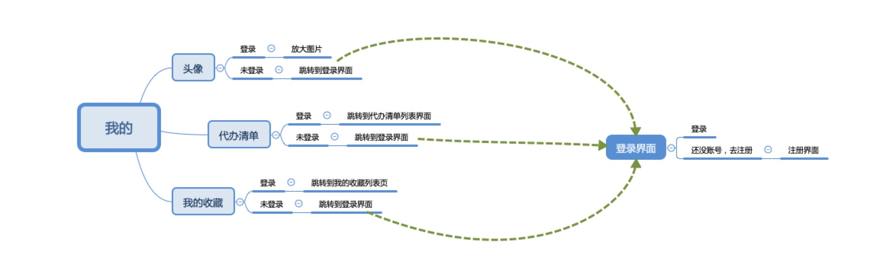

# flutter_wheel

A new Flutter open source  wheel application.

## Getting Started

For help getting started with Flutter, view our online
[documentation](https://flutter.io/).

#### 项目介绍
>- 搭建底部BottomNavigationBar框架，并联动pageview使用中只需要更lib/constants/constant.dart中TabConfig 内的 HOME_TAB_TITLES 、HOME_TAB_NORMALICON、HOME_TAB_ACTIVEICON 这仨个数据中的内容替换成自己想要的就行
>- 本项目中所有网络请求均来自于[玩Android](https://www.wanandroid.com/blog/show/2)
#### 项目效果图
> 
> 

>这里实用的是Flutter中文网开源的项目[Dio](https://github.com/flutterchina/dio)
>另外附两个简书上面对该开源项目的封装 
>- [强大的Flutter Http请求开源库-dio](https://www.jianshu.com/p/bd4c2dc5e97f)
>- [Flutter POST/GET网络请求](https://www.jianshu.com/p/c7e1849676e2)

#### banner_view
> 这里实用的是Flutter官方推荐的
>- [flutter自定义广告Banner](https://blog.csdn.net/a8380381/article/details/84838301)
>- [BannerView1](https://github.com/yangxiaoweihn/BannerView)
>- [BannerView2](https://github.com/zhangruiyu/)
  
#### Flutter_refresh
> 这里是开源的上拉刷新和下拉加载更多Widget
> - [flutter_refresh](https://github.com/best-flutter/flutter_refresh) 
> - [图解 ListView 下拉刷新与上拉加载 (一)【flutter_refresh】](https://www.jianshu.com/p/023b5428aece) 
> - [flutter_refresh 0.0.2](https://pub.flutter-io.cn/packages/flutter_refresh) 

#### Flutter TabBar
>参考博文
>[Flutter之TabBar组件](https://www.jianshu.com/p/fddac387cbe5)  
#### 推荐几个学习Flutter的网站
- [Futter中文网](https://flutterchina.club/)
- [Flutter 社区中文资源](https://flutter-io.cn/)
- [Flutter Packages](https://pub.dartlang.org/flutter/)
- [Flutter 中文开发者社区开源项目](https://github.com/flutterchina)
- [掘金Flutter社区](https://juejin.im/tag/Flutter?utm_source=flutterchina&utm_medium=word&utm_content=btn&utm_campaign=q3_website)
- [一个很棒的Flutter学习资源列表](http://www.devio.org/2018/09/09/awesome-flutter/)
#### 一些比较优秀的Flutter在GitHub上的开源项目
- [Flutter-learning](https://github.com/AweiLoveAndroid/Flutter-learning)

#### 个人开源网站
- [Flutter_Wheel](https://github.com/cbtian/flutter_wheel)

#### 个人博客连接
- 简书
  - [Flutter 学习 - 开篇](https://www.jianshu.com/p/f739c2287473)
  - [Flutter 学习- 基础框架](https://www.jianshu.com/p/897356de9b8b)
  - [Flutter 学习-网络请求和数据解析](https://www.jianshu.com/p/711c2d5b8f86)
  
- csdn 
  - [Flutter 学习 - 开篇](https://blog.csdn.net/wanzhuanit/article/details/88892785)
  - [Flutter 学习- 基础框架](https://blog.csdn.net/wanzhuanit/article/details/88920257)
  - [Flutter 学习-网络请求和数据解析](https://blog.csdn.net/wanzhuanit/article/details/88941874)
#### 机型适配
- [flutter_screenutil](https://github.com/OpenFlutter/flutter_ScreenUtil)

#### 细节优化 
- 沉浸式状态栏的实现
````
 if(Platform.isAndroid){//沉浸式状态栏
    //写在组件渲染之后，是为了在渲染后进行设置赋值，覆盖状态栏，写在渲染之前对MaterialApp组件会覆盖这个值。
    SystemUiOverlayStyle systemUiOverlayStyle = SystemUiOverlayStyle(statusBarColor: Colors.transparent);
    SystemChrome.setSystemUIOverlayStyle(systemUiOverlayStyle);
 }
````
- 去除appbar的阴影
```
    appBar: AppBar(
        elevation: 0.0,//去阴影
      )
```
- listview的item监听是在itemBuild中的widget外面包一层GestureDetector，然后在ontap方法中进行处理逻辑

#### 问题记录
- [使用TabBarView & TabBar遇到一个问题：tab切换的时候，每次都会执行initState](https://www.colabug.com/3162835.html)
- [flutter中tabview切换避免重回](https://www.jianshu.com/p/ff81daaad60b)


#### IOS 问题
引入新库之后没有执行pod命令造成不能导入成功问题
```
pod update --verbose --no-repo-update
pod install --verbose --no-repo-update

```
- [经验：Flutter项目IOS真机部署及问题](https://www.jianshu.com/p/69e1efc2fc55)
- [Error connecting to the service protocol: HttpException: , uri = http://127.0.0.1:1050/ws](https://blog.csdn.net/developer_zhao/article/details/88592852)
- [flutter 运行ios真机报错](https://blog.csdn.net/developer_zhao/article/details/83688033)

#### ios真机在集成 flutter_webview_plugin  使用webview的时候出现崩溃问题  
- 问题描述 
> 1、集成完 flutter_webview_plugin 0.2.1 版本后，在Android真机和ios模拟器上运行都没有问题，但是在ios系统真机测试的时候
> 出现闪退问题
- 解决方案
> 寻找结果发现是flutter_webview_plugin这个插件framework层出了问题，后查看文档[flutter_webview_plugin](https://pub.dartlang.org/packages/flutter_webview_plugin#-changelog-tab-)
> 里面有更新日志就有修复这个ios崩溃问题
> - Fixes rect capture issue. Ensures WebView remains in the correct place on screen even when keyboard appears.
> - == Fixed iOS crash issue with Flutter >= 0.10.2.==
> - Added new clearCookies feature.
> - Added support for hidden and initialChild feature to show page loading view.
> - Added supportMultipleWindows: enables Multiple Window Support on Android.
> - Added appCacheEnabled: enables Application Caches API on Android.
> - Added allowFileURLs: allows file:// local file URLs.
> - iOS Now supports: reload, goBack, and goForward.
> - iOS Bug fix didFailNavigation #77
> - Updated Android compileSdkVersion to 27 matching offical Flutter plugins.
> - Fixed Android reloadUrl so settings are not cleared.
> - Enabled compatible Mixed Content Mode on Android.
> 后将插件版本升级至0.3.0 解决崩溃问题

- 问题描述
> 上述崩溃问题解决后又出现 No named parameter with the name 'resizeToAvoidBottomInset' 的问题
- 解决方案
> 查找Scaffold.dart文件中确实没有找到这个属性值，后将flutter进行升级，问题解决
> flutter 升级方法 在项目的主目录下（有pubspec.dart文件的目录）执行 
  flutter upgrade 命令，等待执行完成即可


