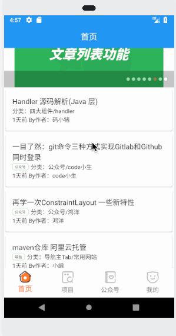

# flutter_wheel

A new Flutter open source  wheel application.

## Getting Started

For help getting started with Flutter, view our online
[documentation](https://flutter.io/).

#### 项目介绍
>- 搭建底部BottomNavigationBar框架，并联动pageview使用中只需要更lib/constants/constant.dart中TabConfig 内的 HOME_TAB_TITLES 、HOME_TAB_NORMALICON、HOME_TAB_ACTIVEICON 这仨个数据中的内容替换成自己想要的就行
>- 本项目中所有网络请求均来自于[玩Android](https://www.wanandroid.com/blog/show/2)
#### 项目效果图
> 

>这里实用的是Flutter中文网开源的项目[Dio](https://github.com/flutterchina/dio)
>另外附两个简书上面对该开源项目的封装 
>- [强大的Flutter Http请求开源库-dio](https://www.jianshu.com/p/bd4c2dc5e97f)
>- [Flutter POST/GET网络请求](https://www.jianshu.com/p/c7e1849676e2)

#### banner_view
> 这里实用的是Flutter官方推荐的
>- [flutter自定义广告Banner](https://blog.csdn.net/a8380381/article/details/84838301)
>- [BannerView1](https://github.com/yangxiaoweihn/BannerView)
>- [BannerView2](https://github.com/zhangruiyu/)
  
#### Flutter_refresh
> 这里是开源的上拉刷新和下拉加载更多Widget
> - [flutter_refresh](https://github.com/best-flutter/flutter_refresh) 
> - [图解 ListView 下拉刷新与上拉加载 (一)【flutter_refresh】](https://www.jianshu.com/p/023b5428aece) 
> - [flutter_refresh 0.0.2](https://pub.flutter-io.cn/packages/flutter_refresh) 

#### Flutter TabBar
>参考博文
>[Flutter之TabBar组件](https://www.jianshu.com/p/fddac387cbe5)  
#### 推荐几个学习Flutter的网站
- [Futter中文网](https://flutterchina.club/)
- [Flutter 社区中文资源](https://flutter-io.cn/)
- [Flutter Packages](https://pub.dartlang.org/flutter/)
- [Flutter 中文开发者社区开源项目](https://github.com/flutterchina)
- [掘金Flutter社区](https://juejin.im/tag/Flutter?utm_source=flutterchina&utm_medium=word&utm_content=btn&utm_campaign=q3_website)
- [一个很棒的Flutter学习资源列表](http://www.devio.org/2018/09/09/awesome-flutter/)
#### 一些比较优秀的Flutter在GitHub上的开源项目
- [Flutter-learning](https://github.com/AweiLoveAndroid/Flutter-learning)

#### 个人开源网站
- [Flutter_Wheel](https://github.com/cbtian/flutter_wheel)

#### 机型适配
- [flutter_screenutil](https://github.com/OpenFlutter/flutter_ScreenUtil)

#### 细节优化 
- 沉浸式状态栏的实现
````
 if(Platform.isAndroid){//沉浸式状态栏
    //写在组件渲染之后，是为了在渲染后进行设置赋值，覆盖状态栏，写在渲染之前对MaterialApp组件会覆盖这个值。
    SystemUiOverlayStyle systemUiOverlayStyle = SystemUiOverlayStyle(statusBarColor: Colors.transparent);
    SystemChrome.setSystemUIOverlayStyle(systemUiOverlayStyle);
 }
````
#### 问题记录
- [使用TabBarView & TabBar遇到一个问题：tab切换的时候，每次都会执行initState](https://www.colabug.com/3162835.html)


